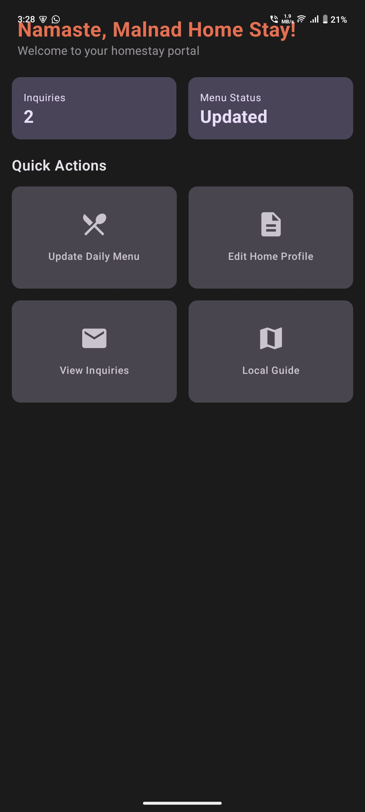
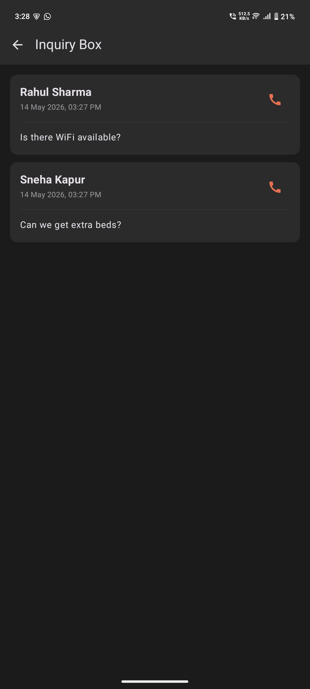
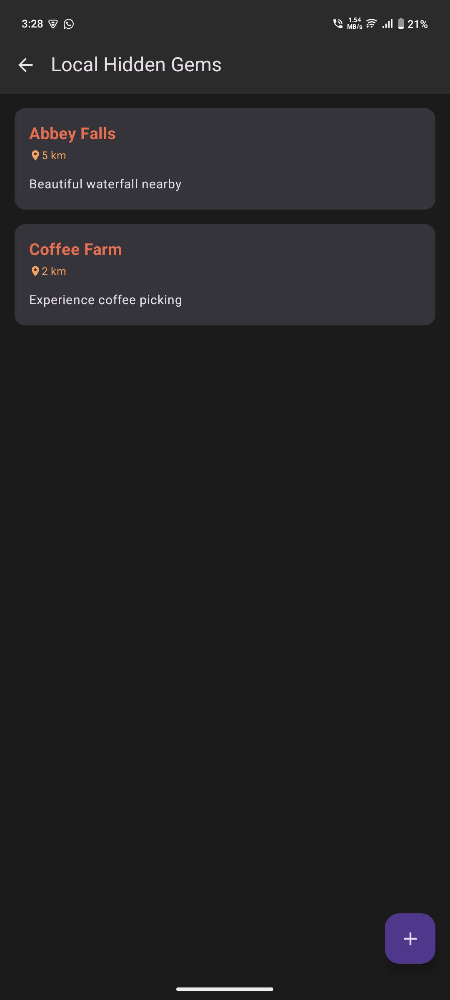
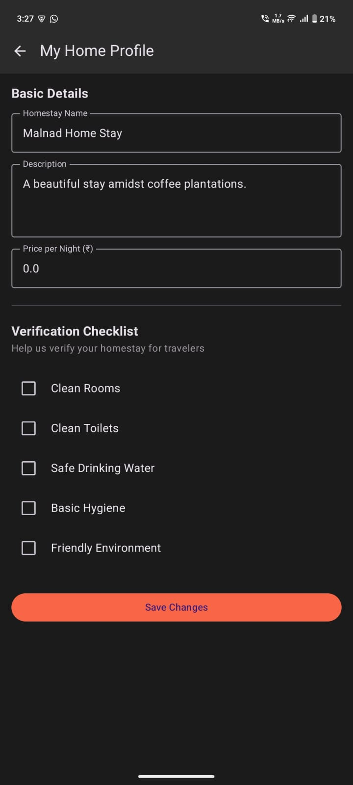
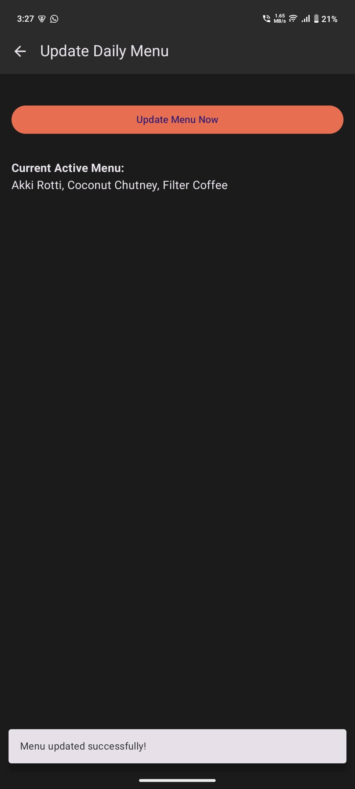

# 🏡 Namma-HomeStay

Namma-HomeStay is an Android application built using **Jetpack Compose** that helps local homestay owners in coastal areas manage and showcase their rooms easily.  
The app focuses on supporting small homestay businesses that are not tech-savvy and helps them participate in the growing eco-tourism and agri-tourism market.

---

# 📸 Project Screenshots

## Home Screen


## Property Listing


## Room Details


## Booking Interface


## Coastal Homestay Experience


---

# ✨ Features

- 🏠 Browse available homestays
- 📍 Coastal tourism focused UI
- 📅 Booking interface
- 🔥 Firebase integration ready
- ⚡ Modern Android architecture
- 🎨 Jetpack Compose UI
- 🌐 Easy-to-use host management system

---

# 🛠 Tech Stack

- **Kotlin**
- **Jetpack Compose**
- **MVVM Architecture**
- **Hilt**
- **Navigation Component**
- **Firebase Firestore**
- **Coil**

---

# 📂 Project Structure

- `data/` → Repository implementations (Firebase & Mock)
- `domain/` → Business logic, models, repository interfaces
- `presentation/` → UI screens, ViewModels, Composables
- `navigation/` → Navigation routes
- `ui/theme/` → Custom coastal color palette
- `di/` → Hilt dependency injection modules

---

# ⚙️ Firebase Configuration

1. Create a Firebase project  
2. Add Android app package:
   ```text
   com.example.nammahomestay
